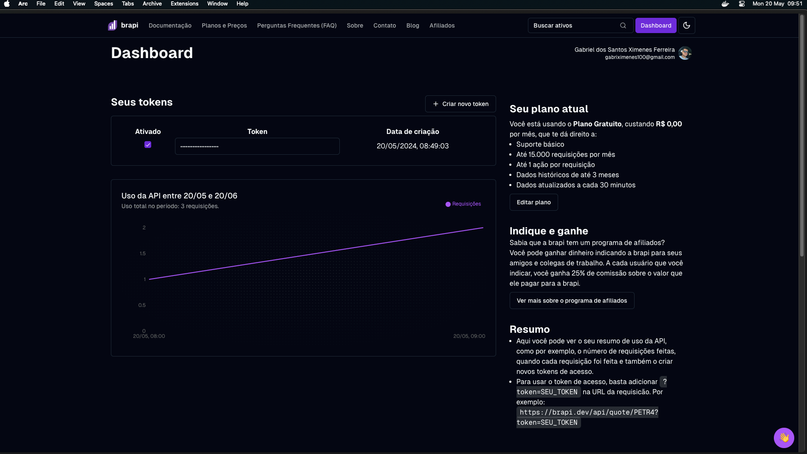

# Olá 👋

### Introdução
Este readme mostra um pouquinho sobre essa aplicação. Foi uma aplicação construida com o intuito de me auxiliar com meus investimentos pessoais
e também para treinar um pouco minhas habilidades backend com o Javinha.
Como o java é write one, run anywhere, baixe o código explore e seja feliz.

### Ferramentas
 
- Utilizei o Java Spring boot versão 21
- MySql para o banco de dados
- Docker para conterização do banco de dados.
- Junit, mockito para testes unitários
- ApiDog para consumir as rotas
- Scalar (testando) para criar documentações das apis.

O Scalar é muito interessante da para importar dados exportados da api pela openAi e importar, ele gera a documentação das rotas de acordo com os dados passados.

### Links
[Documentação de rotas da API](https://investiments.apidocumentation.com/reference#tag/default/post/localhost:8080/users)

### Exemplos
Esse é um exemplo de uma consulta nessa api, com a quantidade de ações que essa conta tem, e o valor total gasto nas ações
detalhe que esse valor total é com base na bolsa de valores atráves da API publica da [brapi](https://brapi.dev/).

### Guia
Para as consultas a api externa, é essencial a criação de uma conta na brapi, e a criação de um token para consultas a api deles, basta acessar o site 

 

Basta acessar o [dashboard](https://brapi.dev/dashboard) e clicar em + Criar novo token. Após isso cole no projeto como uma variável de ambiente.
